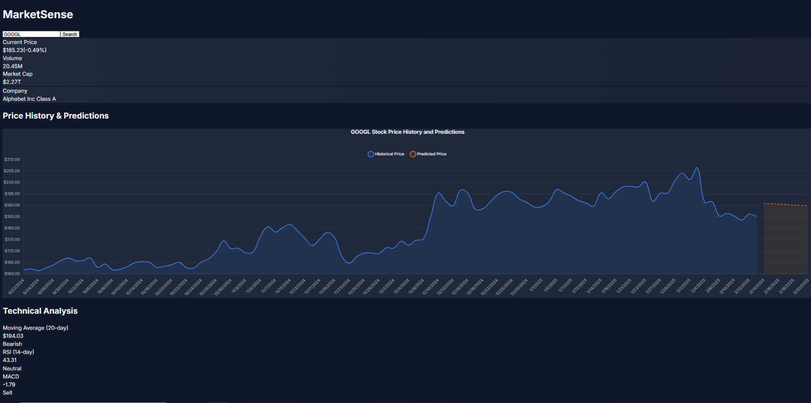
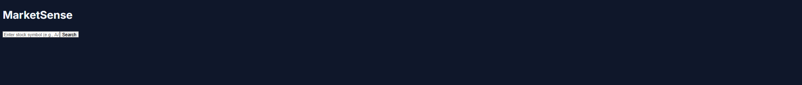

# MarketSense

MarketSense is a modern stock market analytics platform that combines real-time market data with machine learning predictions. Built with FastAPI and React, it provides users with technical analysis, price predictions, and interactive visualizations.



## Features

- 📈 Real-time stock price tracking
- 🤖 Machine learning-based price predictions
- 📊 Technical indicators (RSI, MACD, Moving Averages)
- 🌓 Modern dark mode interface
- 📱 Responsive design for all devices
- 📈 Interactive charts with historical data

## Tech Stack

### Frontend
- React with TypeScript
- TailwindCSS for styling
- Chart.js for data visualization
- Axios for API requests

### Backend
- FastAPI (Python)
- scikit-learn for machine learning
- Alpha Vantage API integration
- pandas for data processing

## Getting Started

### Prerequisites
- Python 3.8+
- Node.js 14+
- Alpha Vantage API key

### Environment Variables

For security reasons, environment variables are not committed to the repository. You'll need to:

1. Get an API key from [Alpha Vantage](https://www.alphavantage.co/support/#api-key)
2. Create a `.env` file in the `backend` directory
3. Add your API key to the `.env` file:
```bash
ALPHA_VANTAGE_API_KEY=your_api_key_here
```

> ⚠️ **Security Note**: Never commit your `.env` file or expose your API keys in your code. The `.env` file is included in `.gitignore` to prevent accidental commits.

### Installation

1. Clone the repository
```bash
git clone https://github.com/PeterS2001/marketsense.git
cd marketsense
```

2. Set up the backend
```bash
cd backend
pip install -r requirements.txt
# Create .env file and add your Alpha Vantage API key
echo "ALPHA_VANTAGE_API_KEY=your_api_key_here" > .env
uvicorn main:app --reload
```

3. Set up the frontend
```bash
cd frontend
npm install
npm run dev
```

4. Open http://localhost:5173 in your browser

## Usage

1. Enter a stock symbol (e.g., AAPL, MSFT, GOOGL)
2. View real-time price data and technical indicators
3. Analyze historical trends and predictions
4. Monitor technical signals for trading insights

## Screenshots

Here are some screenshots of the MarketSense application:




## Contributing

Contributions are welcome! Please feel free to submit a Pull Request.

## License

This project is licensed under the MIT License - see the [LICENSE](LICENSE) file for details.

## Contact

Peter S

Project Link: [https://github.com/PeterS2001/marketsense](https://github.com/PeterS2001/marketsense)

## Acknowledgments

- [Alpha Vantage](https://www.alphavantage.co/) for providing market data
- [FastAPI](https://fastapi.tiangolo.com/) for the backend framework
- [React](https://reactjs.org/) for the frontend framework
- [TailwindCSS](https://tailwindcss.com/) for styling
- [Chart.js](https://www.chartjs.org/) for data visualization
